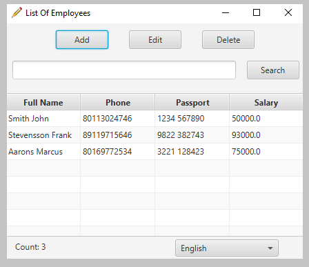
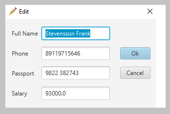

# Book with employees


- [Installation](#anc1)
- [Usage](#anc2)
- [Contribution](#anc3)
- [Example of work](#anc4)
- [License](#anc5)

---
Application, which is book for accounting of employees of the organization (with the possibility of language localization). Support ability to add, delete, change and store data about employees. Have graphical interface for interaction with user.</br>
Realisation by Java 8. [JavaFX](https://openjfx.io/) was used to create a GUI.

<a id="anc1"></a>

## Installation
- The sources for application can be downloaded from the [Github repo](https://github.com/rrtty0/book_with_employees.git).

* You can either clone the public repository:
```
        $ git clone https://github.com/rrtty0/book_with_employees.git 
```
<a id="anc2"></a>

## Usage

- For use this application you must downloaded [JDK 1.8](https://www.oracle.com/ru/java/technologies/javase/javase8-archive-downloads.html)

<a id="anc3"></a>

## Contribution
1. _Clone repo_ and _create a new branch_:
```
        $ git clone https://github.com/rrtty0/book_with_employees.git
        $ git branch name_for_new_branch
        $ git checkout name_for_new_branch
```
2. _Make changes_ and _test_
3. _Submit Pull Request_ with comprehensive description of changes

<a id="anc4"></a>

## Example of work



---



---

<a id="anc5"></a>

## License
Source Available License Agreement - [Apache License](./LICENSE).